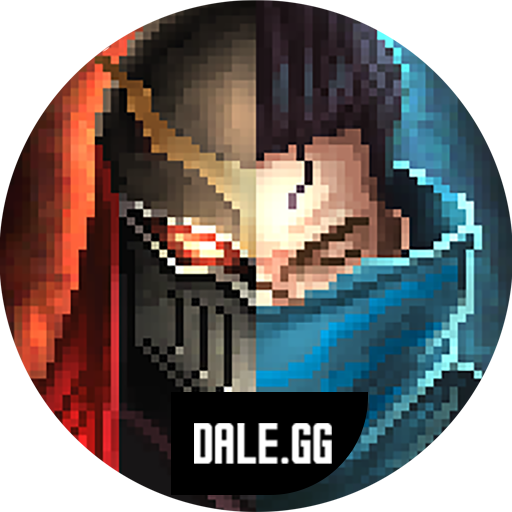

<h1 align="center">
    
</h1>

<h4 align="center">
  🚀 Dale.gg 🎮
</h4>

  

  

  

  

  

  <a href="#-technologys">🚀 Technologys</a>&nbsp;&nbsp;&nbsp;|&nbsp;&nbsp;&nbsp;
  <a href="#-project">💻 Project</a>&nbsp;&nbsp;&nbsp;|&nbsp;&nbsp;&nbsp;
  <a href="#-docs">📊 Docs</a>&nbsp;&nbsp;&nbsp;|&nbsp;&nbsp;&nbsp;
  <a href="#-layout">🔖 Layout</a>&nbsp;&nbsp;&nbsp;|&nbsp;&nbsp;&nbsp;
  <a href="#-how-to-contribute">🤔 How to contribute</a>&nbsp;&nbsp;&nbsp;|&nbsp;&nbsp;&nbsp;
  <a href="#-license">📝 License</a>

 

## 🚀 Technologys

This project was developed with the following technologies:

Languages

- [NodeJS](https://nodejs.org/en/)
- [TypeScript](https://www.typescriptlang.org/)

Linting

- [ESLint](https://eslint.org/)
- [Prettier](https://prettier.io/)

Framework

- [ExpressJS](https://expressjs.com/)

Database and ORM

- [Redis](https://redis.io/)
- [TypeORM](https://typeorm.io/#/)
- [PostgreSQL](https://www.postgresql.org/)

Testing and Development

- [Japa](https://github.com/thetutlage/japa)
- [TSNode](https://github.com/whitecolor/ts-node-dev)

Libs and Utils

- [ZedJS](https://github.com/Dale-gg/dale.gg)
- [Docker](https://www.docker.com/)
- [dedSec](https://github.com/jlenon7/dedSec)

## 💻 Project

Dale.gg is a project that aims to make life easier for League of Legends players, featuring graphics and statistics for players from all regions.

## 📊 Docs

You can check our complete documentation here on our branch [docs](https://github.com/Dale-gg/dale.gg/tree/docs) in addition, we have our [Wiki](https://github.com/jlenon7/dale.gg-omni/wiki), detailing the methodologies used in our project and also their diagrams.

## 🔖 Layout

You can download the project layout in the format `.sketch` or `.fig` através [this link](.github/Screens/Duozada/Duozada.fig).

To open the file in the format `.sketch` or `.fig` on any operating system use the tool [Figma](https://figma.com).

## 🤔 How to contribute

- Fork this repository;
- Create a branch with your feature: `git checkout -b my-feature`;
- Commit your changes: `git commit -m 'feat: My new feature'`;
- Push to your branch: `git push origin my-feature`.

After the merge of your pull request is done, you can delete your branch.

## 📝 License

This project is under the MIT license. See the [LICENSE](LICENSE) for more details.

---

Made with 🖤 by [jlenon7](https://github.com/jlenon7) & [Adryell](https://github.com/adryell) :wave:
